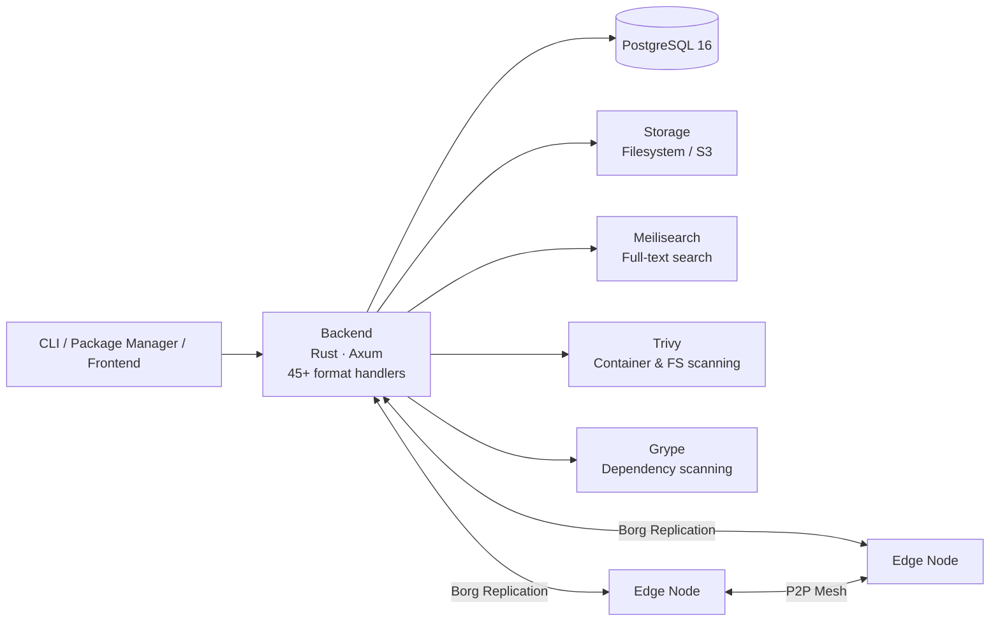
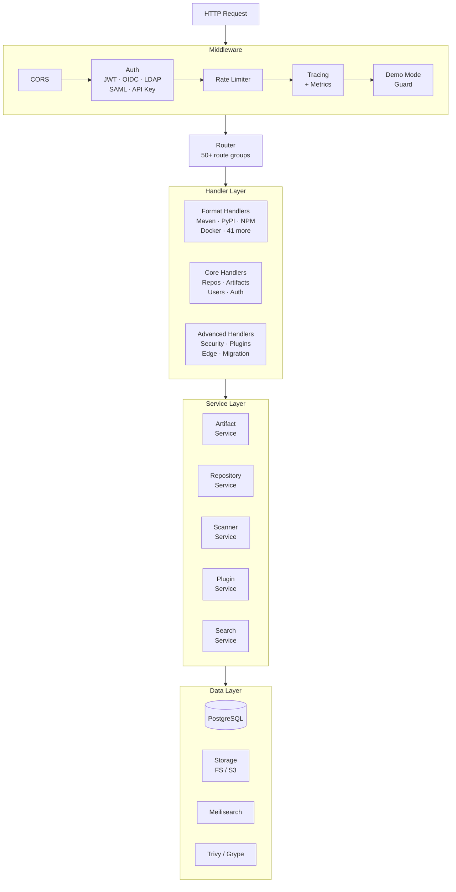
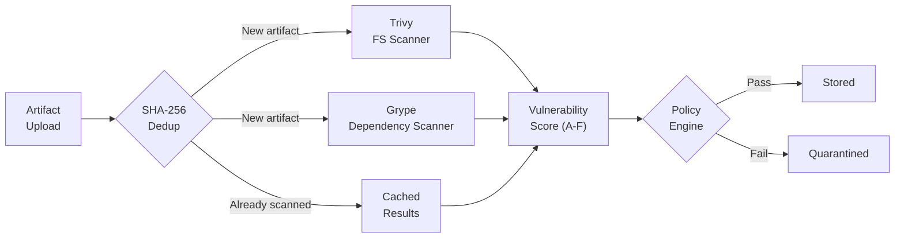
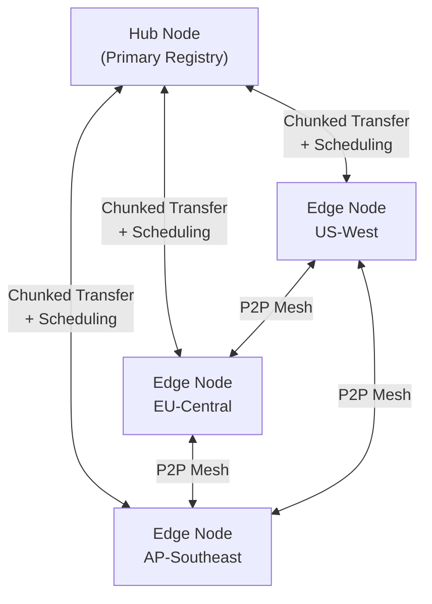

# Artifact Keeper

[](https://github.com/artifact-keeper/artifact-keeper/actions/workflows/ci.yml)
[](LICENSE)
[](https://www.rust-lang.org/)
[](https://ghcr.io/artifact-keeper/artifact-keeper-backend)

An enterprise-grade, open-source artifact registry supporting **45+ package formats**. Built with Rust.

[Documentation](https://artifactkeeper.com/docs/) | [Demo](https://demo.artifactkeeper.com) | [Website](https://artifactkeeper.com)

## Highlights

- **45+ Package Formats** - Native protocol support for Maven, PyPI, NPM, Docker/OCI, Cargo, Go, Helm, and 38 more
- **WASM Plugin System** - Extend with custom format handlers via WebAssembly (WIT-based, Wasmtime runtime)
- **Security Scanning** - Automated vulnerability detection with Trivy and Grype, policy engine, quarantine workflow
- **Borg Replication** - Mesh edge sync with swarm-based artifact distribution and P2P transfers
- **Full-Text Search** - Meilisearch-powered search across all repositories and artifacts
- **Multi-Auth** - JWT, OpenID Connect, LDAP, SAML 2.0, and API token support
- **Artifactory Migration** - Built-in tooling to migrate repositories, artifacts, and permissions from JFrog Artifactory
- **Artifact Signing** - GPG and RSA signing integrated into Debian, RPM, Alpine, and Conda handlers

## System Architecture



## Backend Architecture

The backend follows a layered architecture with a middleware pipeline processing every request.



## Supported Package Formats

45+ formats organized by ecosystem. Each has a native protocol handler that speaks the package manager's wire protocol.

### Languages & Runtimes

| Format | Aliases | Ecosystem |
|--------|---------|-----------|
| **Maven** | Gradle | Java, Kotlin, Scala |
| **NPM** | Yarn, Bower, pnpm | JavaScript, TypeScript |
| **PyPI** | Poetry, Conda | Python |
| **NuGet** | Chocolatey, PowerShell | .NET, C# |
| **Cargo** | | Rust |
| **Go** | | Go modules |
| **RubyGems** | | Ruby |
| **Hex** | | Elixir, Erlang |
| **Composer** | | PHP |
| **Pub** | | Dart, Flutter |
| **CocoaPods** | | iOS, macOS |
| **Swift** | | Swift Package Manager |
| **CRAN** | | R |
| **SBT** | Ivy | Scala, Java |

### Containers & Infrastructure

| Format | Aliases | Ecosystem |
|--------|---------|-----------|
| **Docker / OCI** | Podman, Buildx, ORAS, WASM OCI, Helm OCI | Container images |
| **Helm** | | Kubernetes charts |
| **Terraform** | OpenTofu | Infrastructure modules |
| **Vagrant** | | VM boxes |

### System Packages

| Format | Ecosystem |
|--------|-----------|
| **RPM** | RHEL, Fedora, CentOS |
| **Debian** | Ubuntu, Debian |
| **Alpine** | Alpine Linux (APK) |
| **Conda** | Conda channels |
| **OPKG** | OpenWrt, embedded Linux |

### Configuration Management

| Format | Ecosystem |
|--------|-----------|
| **Chef** | Chef Supermarket |
| **Puppet** | Puppet Forge |
| **Ansible** | Ansible Galaxy |

### ML / AI

| Format | Ecosystem |
|--------|-----------|
| **HuggingFace** | Models, datasets |
| **ML Model** | Generic ML artifacts |

### Editor Extensions

| Format | Aliases | Ecosystem |
|--------|---------|-----------|
| **VS Code** | Cursor, Windsurf, Kiro | Extension marketplace |
| **JetBrains** | | Plugin repository |

### Other

| Format | Ecosystem |
|--------|-----------|
| **Conan** | C, C++ |
| **Git LFS** | Large file storage |
| **Bazel** | Bazel modules |
| **P2** | Eclipse plugins |
| **Generic** | Any file type |

> Custom formats can be added via the [WASM plugin system](#wasm-plugin-system).

## Security Scanning Pipeline

Every artifact upload is automatically scanned for known vulnerabilities.



- **Dual scanner** - Trivy for filesystem/container analysis, Grype for dependency trees
- **Scoring** - A through F grades based on finding severity and count
- **Policies** - Configurable rules that block or quarantine artifacts
- **Signing** - GPG/RSA signing for Debian, RPM, Alpine, and Conda packages

## Borg Replication

Distributed artifact caching with a hub-and-spoke topology that supports peer-to-peer transfers.



- **Swarm-based distribution** - Artifacts replicate across the mesh based on demand
- **Chunked transfers** - Large artifacts split for reliable delivery over unstable links
- **Cache management** - TTL and LRU eviction per edge node
- **Network-aware scheduling** - Bandwidth and latency profiling for optimal routing

## WASM Plugin System

Extend Artifact Keeper with custom format handlers compiled to WebAssembly.

- **WIT-based interface** - Plugins implement a well-defined `FormatHandler` contract
- **Wasmtime runtime** - Sandboxed execution with fuel-based CPU limits and memory caps
- **Hot reload** - Install, enable, disable, and reload plugins without restart
- **Sources** - Load from Git repositories, ZIP uploads, or local paths

## Quick Start

### Docker Compose

```bash
git clone https://github.com/artifact-keeper/artifact-keeper.git
cd artifact-keeper
docker compose up -d
```

Open [http://localhost:30080](http://localhost:30080) in your browser.

> **Production:** Set `SITE_ADDRESS=yourdomain.com` in your environment or `.env` file
> and Caddy will automatically provision TLS certificates via Let's Encrypt.

Default credentials: **admin** / **admin**

> **Important:** Change the default password after first login. For production,
> set `ADMIN_PASSWORD` in your `.env` file or `docker-compose.yml`.

#### What starts

| Service | Description | Port |
|---------|-------------|------|
| **Backend** | Rust API server (45+ format handlers) | 8080 (internal) |
| **Web UI** | Next.js frontend | 3000 (internal) |
| **Caddy** | Reverse proxy + local TLS | **30080** (HTTP), **30443** (HTTPS) |
| **PostgreSQL** | Database | 30432 |
| **Meilisearch** | Full-text search | 7700 |
| **Trivy** | Vulnerability scanning | 8090 |

#### Verify it's working

```bash
# Health check
curl http://localhost:30080/health

# Login and get a token
TOKEN=$(curl -s http://localhost:30080/api/v1/auth/login \
  -H "Content-Type: application/json" \
  -d '{"username":"admin","password":"admin"}' | jq -r '.token')

# List repositories
curl -s http://localhost:30080/api/v1/repositories \
  -H "Authorization: Bearer $TOKEN" | jq
```

### Manual Build

```bash
cargo build --release
./target/release/artifact-keeper
```

Requires Rust 1.75+ and PostgreSQL 16+.

## Configuration

Key environment variables (see [full reference](https://artifactkeeper.com/docs/reference/environment/)):

| Variable | Description | Default |
|----------|-------------|---------|
| `DATABASE_URL` | PostgreSQL connection string | **Required** |
| `JWT_SECRET` | Secret for signing JWT tokens | **Required** |
| `STORAGE_BACKEND` | `filesystem` or `s3` | `filesystem` |
| `STORAGE_PATH` | Local storage directory | `/var/lib/artifact-keeper/artifacts` |
| `S3_BUCKET` | S3 bucket name | - |
| `S3_ENDPOINT` | S3-compatible endpoint URL | - |
| `TRIVY_URL` | Trivy server for security scanning | - |
| `MEILISEARCH_URL` | Meilisearch for full-text search | - |
| `DEMO_MODE` | Block all write operations | `false` |

## Testing

Three-tier testing strategy:

| Tier | Trigger | What runs |
|------|---------|-----------|
| **1** | Every push/PR | `cargo fmt`, `cargo clippy`, `cargo test --lib` |
| **2** | Main branch | Integration tests with PostgreSQL |
| **3** | Release/manual | Native client tests for 10 formats, stress + failure injection |

```bash
# Tier 1 - Fast checks
cargo test --workspace --lib

# Tier 3 - Full E2E
./scripts/run-e2e-tests.sh --profile all
```

## Project Structure

```
artifact-keeper/
├── backend/          # Rust backend (Axum, SQLx, 429 unit tests)
│   ├── src/
│   │   ├── api/      # Handlers, middleware, routes
│   │   ├── formats/  # 45+ format handler implementations
│   │   ├── services/ # Business logic (35+ services)
│   │   ├── models/   # Data models (18 types)
│   │   └── storage/  # FS and S3 backends
│   └── migrations/   # 33 PostgreSQL migrations
├── edge/             # Edge node service (Rust)
├── site/             # Documentation site (Astro + Starlight)
├── specs/            # Feature specifications
├── scripts/          # Test runners, native client tests, stress tests
├── deploy/           # Docker, Kubernetes, demo configs
└── .github/          # CI/CD workflows
```

## Technology Choices

| Layer | Choice | Why |
|-------|--------|-----|
| Backend language | **Rust** | Memory safety, performance, strong type system |
| Web framework | **Axum** | Tower middleware ecosystem, async-first |
| Database | **PostgreSQL 16** | JSONB for metadata, mature ecosystem |
| Search | **Meilisearch** | Fast full-text search, easy to operate |
| Security scanning | **Trivy + Grype** | Complementary coverage, industry standard |
| Plugin runtime | **Wasmtime** | Sandboxed, portable, WIT contract system |
| Storage | **Filesystem / S3** | Simple default, cloud-ready upgrade path |

## Contributing

We welcome contributions! See [CONTRIBUTING.md](CONTRIBUTING.md) for guidelines.

Have questions or ideas? Join the conversation in [GitHub Discussions](https://github.com/artifact-keeper/artifact-keeper/discussions).

## License

MIT License - see [LICENSE](LICENSE) for details.

---

Built with Rust. "JFrog" and "Artifactory" are trademarks of JFrog Ltd. Artifact Keeper is not affiliated with or endorsed by JFrog.
