# Artifact Keeper

[](https://github.com/artifact-keeper/artifact-keeper/actions/workflows/ci.yml)
[](https://sonarcloud.io/dashboard?id=artifact-keeper_artifact-keeper)
[](https://sonarcloud.io/dashboard?id=artifact-keeper_artifact-keeper)
[](https://sonarcloud.io/dashboard?id=artifact-keeper_artifact-keeper)
[](https://sonarcloud.io/dashboard?id=artifact-keeper_artifact-keeper)
[](LICENSE)
[](https://www.rust-lang.org/)
[](https://hub.docker.com/u/artifactkeeper)
[](https://ko-fi.com/bsgeraci)

An enterprise-grade, open-source artifact registry supporting **45+ package formats**. Built with Rust.

[Documentation](https://artifactkeeper.com/docs/) | [Demo](https://demo.artifactkeeper.com) | [Website](https://artifactkeeper.com)

## Highlights

- **45+ Package Formats** - Native protocol support for Maven, PyPI, NPM, Docker/OCI, Cargo, Go, Helm, and 38 more
- **WASM Plugin System** - Extend with custom format handlers via WebAssembly (WIT-based, Wasmtime runtime)
- **Security Scanning** - Automated vulnerability detection with Trivy and Grype, policy engine, quarantine workflow
- **Hardened Containers** - All images built on [DISA STIG](https://www.cyber.mil/stigs/)-approved Red Hat UBI 9 base images, non-root execution, no shell or package manager in runtime
- **Borg Replication** - Recursive peer mesh with swarm-based artifact distribution and P2P transfers
- **Full-Text Search** - Meilisearch-powered search across all repositories and artifacts
- **Multi-Auth** - JWT, OpenID Connect, LDAP, SAML 2.0, and API token support
- **Artifactory Migration** - Built-in tooling to migrate repositories, artifacts, and permissions from JFrog Artifactory
- **Artifact Signing** - GPG and RSA signing integrated into Debian, RPM, Alpine, and Conda handlers

## System Architecture

```mermaid
graph LR
    Client["CLI / Package Manager / Frontend"]
    Backend["Backend<br/>Rust · Axum<br/>45+ format handlers"]
    DB[(PostgreSQL 16)]
    Storage["Storage<br/>Filesystem / S3"]
    Meili["Meilisearch<br/>Full-text search"]
    Trivy["Trivy<br/>Container & FS scanning"]
    Grype["Grype<br/>Dependency scanning"]
    OpenSCAP["OpenSCAP<br/>Compliance scanning"]
    Peer1["Peer Instance"]
    Peer2["Peer Instance"]

    Client --> Backend
    Backend --> DB
    Backend --> Storage
    Backend --> Meili
    Backend --> Trivy
    Backend --> Grype
    Backend --> OpenSCAP
    Backend <-->|Borg Replication| Peer1
    Backend <-->|Borg Replication| Peer2
    Peer1 <-->|P2P Mesh| Peer2
```



## Backend Architecture

The backend follows a layered architecture with a middleware pipeline processing every request.

```mermaid
flowchart TD
    REQ["HTTP Request"] --> MW["Middleware Pipeline"]

    subgraph MW["Middleware"]
        direction LR
        CORS["CORS"] --> AUTH["Auth<br/>JWT · OIDC · LDAP<br/>SAML · API Key"]
        AUTH --> RL["Rate Limiter"]
        RL --> TRACE["Tracing<br/>+ Metrics"]
        TRACE --> DEMO["Demo Mode<br/>Guard"]
    end

    MW --> ROUTER["Router<br/>50+ route groups"]

    subgraph HANDLERS["Handler Layer"]
        FMT["Format Handlers<br/>Maven · PyPI · NPM<br/>Docker · 41 more"]
        CORE["Core Handlers<br/>Repos · Artifacts<br/>Users · Auth"]
        ADV["Advanced Handlers<br/>Security · Plugins<br/>Peers · Migration"]
    end

    ROUTER --> HANDLERS

    subgraph SERVICES["Service Layer"]
        direction LR
        ART["Artifact<br/>Service"]
        REPO["Repository<br/>Service"]
        SCAN["Scanner<br/>Service"]
        PLUG["Plugin<br/>Service"]
        SEARCH["Search<br/>Service"]
    end

    HANDLERS --> SERVICES

    subgraph DATA["Data Layer"]
        direction LR
        PG[(PostgreSQL)]
        FS["Storage<br/>FS / S3"]
        MS["Meilisearch"]
        SC["Trivy / Grype / OpenSCAP"]
    end

    SERVICES --> DATA
```



## Supported Package Formats

45+ formats organized by ecosystem. Each has a native protocol handler that speaks the package manager's wire protocol.

### Languages & Runtimes

| Format | Aliases | Ecosystem |
|--------|---------|-----------|
| **Maven** | Gradle | Java, Kotlin, Scala |
| **NPM** | Yarn, Bower, pnpm | JavaScript, TypeScript |
| **PyPI** | Poetry, Conda | Python |
| **NuGet** | Chocolatey, PowerShell | .NET, C# |
| **Cargo** | | Rust |
| **Go** | | Go modules |
| **RubyGems** | | Ruby |
| **Hex** | | Elixir, Erlang |
| **Composer** | | PHP |
| **Pub** | | Dart, Flutter |
| **CocoaPods** | | iOS, macOS |
| **Swift** | | Swift Package Manager |
| **CRAN** | | R |
| **SBT** | Ivy | Scala, Java |

### Containers & Infrastructure

| Format | Aliases | Ecosystem |
|--------|---------|-----------|
| **Docker / OCI** | Podman, Buildx, ORAS, WASM OCI, Helm OCI | Container images |
| **Helm** | | Kubernetes charts |
| **Terraform** | OpenTofu | Infrastructure modules |
| **Vagrant** | | VM boxes |

### System Packages

| Format | Ecosystem |
|--------|-----------|
| **RPM** | RHEL, Fedora, CentOS |
| **Debian** | Ubuntu, Debian |
| **Alpine** | Alpine Linux (APK) |
| **Conda** | Conda channels |
| **OPKG** | OpenWrt, embedded Linux |

### Configuration Management

| Format | Ecosystem |
|--------|-----------|
| **Chef** | Chef Supermarket |
| **Puppet** | Puppet Forge |
| **Ansible** | Ansible Galaxy |

### ML / AI

| Format | Ecosystem |
|--------|-----------|
| **HuggingFace** | Models, datasets |
| **ML Model** | Generic ML artifacts |

### Editor Extensions

| Format | Aliases | Ecosystem |
|--------|---------|-----------|
| **VS Code** | | Extension marketplace (VS Code, Cursor, Windsurf, Kiro) |
| **JetBrains** | | Plugin repository |

### Schemas

| Format | Ecosystem |
|--------|-----------|
| **Protobuf / BSR** | Buf Schema Registry, Connect RPC |

### Other

| Format | Ecosystem |
|--------|-----------|
| **Conan** | C, C++ |
| **Git LFS** | Large file storage |
| **Bazel** | Bazel modules |
| **P2** | Eclipse plugins |
| **Generic** | Any file type |

> Custom formats can be added via the [WASM plugin system](#wasm-plugin-system).

## Security Scanning Pipeline

Every artifact upload is automatically scanned for known vulnerabilities.


- **Dual scanner** - Trivy for filesystem/container analysis, Grype for dependency trees
- **Scoring** - A through F grades based on finding severity and count
- **Policies** - Configurable rules that block or quarantine artifacts
- **Signing** - GPG/RSA signing for Debian, RPM, Alpine, and Conda packages

## Borg Replication

Recursive peer-to-peer replication where every node is a full Artifact Keeper instance. No thin caches — each peer runs the same stack and can serve as an origin for other peers.


- **Recursive peers** - Every peer is a full instance (backend, DB, storage) that can originate replication to other peers
- **Swarm-based distribution** - Artifacts replicate across the mesh based on demand
- **Chunked transfers** - Large artifacts split for reliable delivery over unstable links
- **Network-aware scheduling** - Bandwidth and latency profiling for optimal routing

## WASM Plugin System

Extend Artifact Keeper with custom format handlers compiled to WebAssembly.

- **WIT-based interface** - Plugins implement a well-defined `FormatHandler` contract
- **Wasmtime runtime** - Sandboxed execution with fuel-based CPU limits and memory caps
- **Hot reload** - Install, enable, disable, and reload plugins without restart
- **Sources** - Load from Git repositories or ZIP uploads

## Quick Start

```bash
mkdir artifact-keeper && cd artifact-keeper
curl -fsSLO https://raw.githubusercontent.com/artifact-keeper/artifact-keeper/main/docker-compose.yml
curl -fsSLO https://raw.githubusercontent.com/artifact-keeper/artifact-keeper/main/docker/Caddyfile
docker compose up -d
```

Open [http://localhost:30080](http://localhost:30080) and follow the first-time setup instructions.

### Accessing from another machine on your network

In development mode (`ENVIRONMENT=development`, the default), CORS automatically allows requests from private-network IPs (`192.168.x.x`, `10.x.x.x`, `172.16-31.x.x`) and localhost. No extra configuration is needed — just open `http://<server-ip>:30080` from any machine on your LAN.

For production deployments, set `CORS_ORIGINS` in your `.env` to the public URL(s) users will access:

```bash
ENVIRONMENT=production
CORS_ORIGINS=https://registry.example.com
```

**[Full Quickstart Guide →](https://artifactkeeper.com/docs/getting-started/quickstart/)**

## Documentation

- **[Quickstart](https://artifactkeeper.com/docs/getting-started/quickstart/)** — Get running in 5 minutes
- **[Installation](https://artifactkeeper.com/docs/getting-started/installation/)** — Docker Compose or build from source
- **[Configuration](https://artifactkeeper.com/docs/getting-started/configuration/)** — Environment variables reference
- **[Package Formats](https://artifactkeeper.com/docs/package-formats/)** — All 45+ supported formats
- **[Docker Deployment](https://artifactkeeper.com/docs/deployment/docker/)** — Production setup guide

## Project Structure

```
artifact-keeper/
├── backend/          # Rust backend (Axum, SQLx, 429 unit tests)
│   ├── src/
│   │   ├── api/      # Handlers, middleware, routes
│   │   ├── formats/  # 45+ format handler implementations
│   │   ├── services/ # Business logic (35+ services)
│   │   ├── models/   # Data models (18 types)
│   │   └── storage/  # FS and S3 backends
│   └── migrations/   # 33 PostgreSQL migrations
├── edge/             # Peer replication service (Rust)
├── scripts/          # Test runners, native client tests, stress tests
└── .github/          # CI/CD workflows
```

## Technology Choices

| Layer | Choice | Why |
|-------|--------|-----|
| Backend language | **Rust** | Memory safety, performance, strong type system |
| Web framework | **Axum** | Tower middleware ecosystem, async-first |
| Database | **PostgreSQL 16** | JSONB for metadata, mature ecosystem |
| Search | **Meilisearch** | Fast full-text search, easy to operate |
| Security scanning | **Trivy + Grype + OpenSCAP** | Complementary coverage, industry standard |
| Plugin runtime | **Wasmtime** | Sandboxed, portable, WIT contract system |
| Storage | **Filesystem / S3** | Simple default, cloud-ready upgrade path |

## CI/CD Pipeline

Seven GitHub Actions workflows handle testing, publishing, and deployment.

```mermaid
flowchart TD
    subgraph TRIGGER["Triggers"]
        PUSH["Push / PR<br/>to main"]
        TAG["Tag v*"]
        CRON["Daily 2 AM UTC"]
        SITE_PUSH["Push to site/**"]
    end

    subgraph CI["ci.yml — Every Push/PR"]
        direction TB
        LINT["🦀 Lint Rust<br/>fmt + clippy"]
        UNIT["🧪 Unit Tests<br/>cargo test --lib"]
        INTEG["🔗 Integration Tests<br/>+ PostgreSQL<br/>(main push only)"]
        SMOKE["🔥 Smoke E2E<br/>PyPI · npm · Cargo<br/>docker-compose.test.yml"]
        AUDIT["🔒 Security Audit<br/>cargo audit"]
        CI_OK["✅ CI Complete"]

        LINT --> UNIT
        LINT --> INTEG
        UNIT --> SMOKE
        SMOKE --> CI_OK
        AUDIT --> CI_OK
    end

    subgraph DOCKER["docker-publish.yml — Push to main / tags"]
        direction TB
        BE_BUILD["Backend<br/>amd64 + arm64"]
        OS_BUILD["OpenSCAP<br/>amd64 + arm64"]
        BE_MERGE["Multi-Arch<br/>Manifest"]
        OS_MERGE["Multi-Arch<br/>Manifest"]

        BE_BUILD --> BE_MERGE
        OS_BUILD --> OS_MERGE
    end

    subgraph E2E["e2e.yml — Manual / called by release"]
        direction TB
        PKI["🔐 Setup PKI<br/>TLS + GPG"]
        NATIVE["📦 Native Client Tests<br/>10 formats"]
        STRESS["🔥 Stress Tests<br/>100 concurrent uploads"]
        FAILURE["💥 Failure Tests<br/>crash · db · storage"]

        PKI --> NATIVE
        NATIVE --> STRESS
        NATIVE --> FAILURE
    end

    subgraph RELEASE["release.yml — Tags v*"]
        direction TB
        E2E_GATE["🚦 E2E Gate<br/>all formats + stress + failure"]
        BINARIES["📦 Build Binaries<br/>linux + macOS<br/>amd64 + arm64"]
        GH_RELEASE["🚀 GitHub Release<br/>binaries + checksums"]

        E2E_GATE --> BINARIES
        BINARIES --> GH_RELEASE
    end

    subgraph NIGHTLY["scheduled-tests.yml — Daily"]
        direction TB
        NIGHTLY_E2E["🌙 Nightly Smoke E2E"]
        DEP_CHECK["🔍 Dependency Check"]
        SEC_SCAN["🔒 Security Scan"]
    end

    subgraph SITE["site.yml"]
        PAGES["📄 Build + Deploy<br/>GitHub Pages"]
    end

    subgraph AMI["ami-build.yml"]
        PACKER["🖥️ Packer Build AMI"]
    end

    PUSH --> CI
    PUSH --> DOCKER
    TAG --> RELEASE
    TAG --> DOCKER
    CRON --> NIGHTLY
    SITE_PUSH --> SITE
    GH_RELEASE -.->|"on release published"| AMI

    classDef trigger fill:#6f42c1,color:#fff,stroke:#6f42c1
    classDef ci fill:#2ea44f,color:#fff,stroke:#2ea44f
    classDef docker fill:#0969da,color:#fff,stroke:#0969da
    classDef release fill:#d97706,color:#fff,stroke:#d97706

    class PUSH,TAG,CRON,SITE_PUSH trigger
    class LINT,UNIT,INTEG,SMOKE,AUDIT,CI_OK ci
    class BE_BUILD,OS_BUILD,BE_MERGE,OS_MERGE docker
    class E2E_GATE,BINARIES,GH_RELEASE release
```



| Workflow | Trigger | What It Does |
|----------|---------|--------------|
| **ci.yml** | Every push/PR | Lint, unit tests, integration tests, smoke E2E (PyPI, npm, Cargo) |
| **docker-publish.yml** | Push to main, tags | Multi-arch Docker images (backend + OpenSCAP) to ghcr.io |
| **e2e.yml** | Manual or called by release | Full E2E: 10 native client formats, stress, failure injection |
| **release.yml** | Tags `v*` | E2E gate, cross-platform binaries, GitHub Release |
| **scheduled-tests.yml** | Daily 2 AM UTC | Nightly smoke E2E, dependency check, security scan |
| **site.yml** | Push to `site/**` | Build and deploy docs to GitHub Pages |
| **ami-build.yml** | On release published | Bake AWS AMI with Packer |

## Contributing

We welcome contributions! See [CONTRIBUTING.md](CONTRIBUTING.md) for guidelines.

Have questions or ideas? Join the conversation in [GitHub Discussions](https://github.com/artifact-keeper/artifact-keeper/discussions).

## License

MIT License - see [LICENSE](LICENSE) for details.

---

Built with Rust. "JFrog" and "Artifactory" are trademarks of JFrog Ltd. Artifact Keeper is not affiliated with or endorsed by JFrog.
