Edge nodes enable distributed caching of artifacts closer to consumers, reducing latency and primary server load for geographically distributed teams.

## Architecture Overview

```mermaid
graph TD
    DEV["👩‍💻 Developer\nSydney"]
    CI["🔄 CI/CD\nGitHub Actions"]
    PM["📦 Package Manager\nnpm · pip · docker"]

    subgraph PRIMARY["🏛️ Primary Node · us-east-1"]
        direction TB
        HUB_BE["⚙️ Backend\nSource of Truth"]
        HUB_DB[("🐘 PostgreSQL")]
        HUB_ST["💾 Storage"]
        HUB_MS["🔍 Meilisearch"]
        HUB_BE --> HUB_DB
        HUB_BE --> HUB_ST
        HUB_BE --> HUB_MS
    end

    subgraph EDGES["🌐 Edge Nodes"]
        direction LR

        subgraph USW["us-west-2"]
            E1["📡 Edge\nCache · Read-Only"]
        end

        subgraph EU["eu-west-1"]
            E2["📡 Edge\nCache · Read-Only"]
        end

        subgraph AP["ap-southeast-1"]
            E3["📡 Edge\nCache · Read-Only"]
        end
    end

    CI -->|"push"| HUB_BE
    HUB_BE -->|"Chunked\nReplication"| E1
    HUB_BE -->|"Chunked\nReplication"| E2
    HUB_BE -->|"Chunked\nReplication"| E3

    E1 <-->|"P2P Mesh"| E2
    E2 <-->|"P2P Mesh"| E3
    E1 <-->|"P2P Mesh"| E3

    DEV -->|"pull"| E3
    PM -->|"install"| E1

    classDef primary fill:#2ea44f,color:#fff,stroke:#2ea44f,font-weight:bold
    classDef edge fill:#1d63ed,color:#fff,stroke:#1d63ed
    classDef client fill:#6f42c1,color:#fff,stroke:#6f42c1
    classDef datastore fill:#d97706,color:#fff,stroke:#d97706

    class HUB_BE primary
    class HUB_DB,HUB_ST,HUB_MS datastore
    class E1,E2,E3 edge
    class DEV,CI,PM client
```



### Key Concepts

- **Primary Node**: The authoritative registry where artifacts are uploaded — source of truth for all metadata and storage
- **Edge Nodes**: Read-only cache nodes that serve artifacts to local consumers with low latency
- **Chunked Replication**: Artifacts are split into chunks for reliable, resumable delivery to edge nodes
- **P2P Mesh**: Edge nodes transfer chunks between each other, reducing hub bandwidth
- **Network-Aware Routing**: Clients automatically redirected to the nearest healthy edge

## Setting Up Edge Nodes

### Primary Node Configuration

```bash
# Primary node settings
ROLE=primary
EDGE_ENABLED=true
EDGE_SECRET_KEY=generate-secure-secret-here

# Allow edge node registration
EDGE_AUTO_REGISTER=true  # Or manually approve
```

### Edge Node Configuration

```bash
# Edge node settings
ROLE=edge
PRIMARY_URL=https://primary.example.com
EDGE_API_KEY=your-edge-api-key-from-primary
EDGE_REGION=us-west-2
EDGE_CACHE_SIZE_MB=102400  # 100 GB cache

# Storage for cached artifacts
STORAGE_BACKEND=filesystem
STORAGE_PATH=/var/lib/artifact-keeper/cache
```

### Edge Node Registration

Edge nodes automatically register with the primary on startup:

```bash
# Start edge node
./artifact-keeper-edge

# Manual registration via API
curl -X POST https://primary.example.com/api/v1/edge-nodes \
  -H "Authorization: Bearer $ADMIN_TOKEN" \
  -H "Content-Type: application/json" \
  -d '{
    "name": "edge-us-west",
    "region": "us-west-2",
    "url": "https://edge-usw.example.com",
    "capacity_mb": 102400
  }'
```

## Edge Node Management

### Listing Edge Nodes

```bash
curl https://primary.example.com/api/v1/edge-nodes \
  -H "Authorization: Bearer $TOKEN"
```

Response:

```json
{
  "nodes": [
    {
      "id": "edge-123",
      "name": "edge-us-west",
      "region": "us-west-2",
      "url": "https://edge-usw.example.com",
      "status": "healthy",
      "last_heartbeat": "2026-02-01T12:34:56Z",
      "cache_size_mb": 45678,
      "capacity_mb": 102400,
      "repositories": ["repo-1", "repo-2"]
    }
  ]
}
```

### Heartbeat Mechanism

Edge nodes send periodic heartbeats to the primary:

```bash
# Edge node heartbeat interval
EDGE_HEARTBEAT_INTERVAL=60  # Seconds
```

If a heartbeat is missed:
- After 3 minutes: Node marked as degraded
- After 10 minutes: Node marked as offline
- Clients automatically fail over to primary or other edges

### Assigning Repositories to Edges

Control which repositories are cached by which edge nodes:

```bash
# Assign repository to edge
curl -X POST https://primary.example.com/api/v1/edge-nodes/edge-123/repositories \
  -H "Authorization: Bearer $ADMIN_TOKEN" \
  -H "Content-Type: application/json" \
  -d '{
    "repository_id": "repo-456",
    "priority": "high"
  }'

# Remove repository from edge
curl -X DELETE https://primary.example.com/api/v1/edge-nodes/edge-123/repositories/repo-456 \
  -H "Authorization: Bearer $ADMIN_TOKEN"
```

### Priority Levels

- **high**: Proactively replicate all artifacts
- **medium**: Replicate on first access (lazy loading)
- **low**: Cache only frequently accessed artifacts

## Replication

### Automatic Replication

When an artifact is uploaded to the primary:

1. Primary accepts upload and stores artifact
2. Primary notifies assigned edge nodes
3. Edges download artifact in background
4. Edges report completion to primary

### Peer-to-Peer Chunk Transfer

For large artifacts, edges can transfer chunks from each other:

```bash
# Enable P2P transfer
EDGE_P2P_ENABLED=true
EDGE_P2P_MAX_PEERS=5
```

Transfer flow:

1. Edge A requests artifact from primary
2. Primary responds with peer list (edges that already have it)
3. Edge A downloads chunks from multiple peers in parallel
4. Edge A verifies integrity and serves to clients

### Bandwidth Control

```bash
# Limit replication bandwidth
EDGE_REPLICATION_BANDWIDTH_MBPS=100

# Replication schedule (off-peak hours)
EDGE_REPLICATION_SCHEDULE="0 2-6 * * *"  # 2 AM - 6 AM
```

### Selective Sync

Configure what gets replicated:

```bash
# Only replicate artifacts larger than threshold
EDGE_MIN_ARTIFACT_SIZE_MB=10

# Only replicate recently accessed artifacts
EDGE_SYNC_STRATEGY=lru  # or 'all', 'popular'

# Maximum age of artifacts to replicate
EDGE_MAX_ARTIFACT_AGE_DAYS=90
```

## Network-Aware Scheduling

Clients are automatically routed to the optimal edge node based on:

### Geographic Routing

```bash
# Client makes request to primary
curl https://primary.example.com/api/v1/packages/my-app/1.0.0/download

# Primary responds with redirect to nearest edge
HTTP/1.1 302 Found
Location: https://edge-usw.example.com/api/v1/packages/my-app/1.0.0/download
```

### Load Balancing

If multiple edges serve a region:

- Round-robin distribution
- Least-connections algorithm
- Health-based routing (avoid degraded nodes)

### Fallback Strategy

If edge is unavailable:

1. Try next nearest edge
2. Fall back to primary
3. Client retries with exponential backoff

### Client Configuration

Configure client to use edge-aware registry:

```bash
# Docker
docker login primary.example.com  # Automatically redirected

# Maven
<mirror>
  <id>artifact-keeper</id>
  <url>https://primary.example.com/maven2</url>
</mirror>

# npm (supports redirects)
npm config set registry https://primary.example.com/npm/
```

## Cache Management

### Cache Size Limits

```bash
EDGE_CACHE_SIZE_MB=102400  # Hard limit
EDGE_CACHE_HIGH_WATER_MARK=90  # Start eviction at 90%
```

### Eviction Policies

When cache is full:

- **LRU** (Least Recently Used): Default, evict oldest accessed
- **LFU** (Least Frequently Used): Evict least popular
- **FIFO** (First In First Out): Evict oldest cached

```bash
EDGE_EVICTION_POLICY=lru
```

### Cache Warming

Pre-populate cache with important artifacts:

```bash
curl -X POST https://edge-usw.example.com/api/v1/cache/warm \
  -H "Authorization: Bearer $EDGE_API_KEY" \
  -H "Content-Type: application/json" \
  -d '{
    "repository_id": "repo-123",
    "package_pattern": "my-app-*",
    "versions": ["latest", "1.*"]
  }'
```

### Cache Invalidation

Invalidate cached artifacts when updated:

```bash
# Invalidate specific artifact
curl -X DELETE https://edge-usw.example.com/api/v1/cache/artifacts/artifact-789 \
  -H "Authorization: Bearer $EDGE_API_KEY"

# Invalidate entire repository
curl -X DELETE https://edge-usw.example.com/api/v1/cache/repositories/repo-123 \
  -H "Authorization: Bearer $EDGE_API_KEY"
```

## Monitoring

### Edge Node Metrics

```text
artifact_keeper_edge_cache_size_bytes
artifact_keeper_edge_cache_hits_total
artifact_keeper_edge_cache_misses_total
artifact_keeper_edge_replication_lag_seconds
artifact_keeper_edge_p2p_transfers_total
```

### Health Checks

```bash
# Check edge health
curl https://edge-usw.example.com/api/v1/health

# Response
{
  "status": "healthy",
  "cache_size_mb": 45678,
  "capacity_mb": 102400,
  "cache_hit_rate": 0.87,
  "primary_reachable": true,
  "last_sync": "2026-02-01T12:30:00Z"
}
```

### Replication Status

```bash
# Check replication lag
curl https://primary.example.com/api/v1/edge-nodes/edge-123/replication-status \
  -H "Authorization: Bearer $TOKEN"
```

## Deployment Patterns

### Global CDN Pattern

Deploy edge nodes in each major region:

- us-east-1 (Virginia)
- us-west-2 (Oregon)
- eu-west-1 (Ireland)
- ap-southeast-1 (Singapore)

### Office/Site Pattern

Deploy edge node in each office location:

- Headquarters
- Regional offices
- Development centers
- Manufacturing sites

### Hybrid Cloud Pattern

- Primary in cloud (AWS, GCP, Azure)
- Edge nodes on-premises for low-latency access
- Synchronization over VPN or direct connect

## Security Considerations

### API Key Rotation

```bash
# Generate new edge API key
curl -X POST https://primary.example.com/api/v1/edge-nodes/edge-123/rotate-key \
  -H "Authorization: Bearer $ADMIN_TOKEN"

# Update edge configuration
EDGE_API_KEY=new-key-here

# Restart edge node
```

### TLS/mTLS

Use mutual TLS for edge-to-primary communication:

```bash
# Primary validates edge certificates
EDGE_MTLS_ENABLED=true
EDGE_CA_CERT=/etc/ssl/ca.crt

# Edge presents client certificate
EDGE_CLIENT_CERT=/etc/ssl/edge.crt
EDGE_CLIENT_KEY=/etc/ssl/edge.key
```

### Network Segmentation

- Edge nodes in DMZ or public subnet
- Primary in private subnet
- Firewall rules limiting edge-to-primary traffic

## Troubleshooting

### Edge Node Not Registering

Check network connectivity:

```bash
curl https://primary.example.com/api/v1/health
```

Verify API key:

```bash
echo $EDGE_API_KEY
```

Check primary logs for registration attempts.

### High Replication Lag

- Increase bandwidth allocation
- Enable P2P transfers
- Add more edge nodes to distribute load
- Check network latency to primary

### Low Cache Hit Rate

- Increase cache size
- Adjust eviction policy
- Pre-warm cache with popular artifacts
- Review client access patterns
