Peer replication enables distributed artifact storage across multiple Artifact Keeper instances. Every peer is a full instance — same backend, database, and storage — that can originate replication to other peers. There is no distinction between "primary" and "edge"; any peer can push to or pull from any other peer.

## Architecture Overview

```mermaid
graph TD
    DEV["👩‍💻 Developer\nSydney"]
    CI["🔄 CI/CD\nGitHub Actions"]
    PM["📦 Package Manager\nnpm · pip · docker"]

    subgraph P1["🏛️ Peer · us-east-1"]
        direction TB
        P1_BE["⚙️ Backend"]
        P1_DB[("🐘 PostgreSQL")]
        P1_ST["💾 Storage"]
        P1_MS["🔍 Meilisearch"]
        P1_BE --> P1_DB
        P1_BE --> P1_ST
        P1_BE --> P1_MS
    end

    subgraph PEERS["🌐 Peer Instances"]
        direction LR

        subgraph USW["us-west-2"]
            P2_BE["⚙️ Peer\nFull Instance"]
        end

        subgraph EU["eu-west-1"]
            P3_BE["⚙️ Peer\nFull Instance"]
        end

        subgraph AP["ap-southeast-1"]
            P4_BE["⚙️ Peer\nFull Instance"]
        end
    end

    CI -->|"push"| P1_BE
    P1_BE <-->|"Chunked\nReplication"| P2_BE
    P1_BE <-->|"Chunked\nReplication"| P3_BE
    P1_BE <-->|"Chunked\nReplication"| P4_BE

    P2_BE <-->|"P2P Mesh"| P3_BE
    P3_BE <-->|"P2P Mesh"| P4_BE
    P2_BE <-->|"P2P Mesh"| P4_BE

    DEV -->|"pull"| P4_BE
    PM -->|"install"| P2_BE

    classDef peer fill:#2ea44f,color:#fff,stroke:#2ea44f,font-weight:bold
    classDef client fill:#6f42c1,color:#fff,stroke:#6f42c1
    classDef datastore fill:#d97706,color:#fff,stroke:#d97706

    class P1_BE,P2_BE,P3_BE,P4_BE peer
    class P1_DB,P1_ST,P1_MS datastore
    class DEV,CI,PM client
```



### Key Concepts

- **Peer Instance**: A full Artifact Keeper deployment (backend, database, storage) that participates in the replication mesh
- **Recursive Replication**: Any peer can originate replication to any other peer — no fixed hub
- **Chunked Replication**: Artifacts are split into chunks for reliable, resumable delivery between peers
- **P2P Mesh**: Peers transfer chunks between each other, distributing load across the network
- **Network-Aware Routing**: Clients automatically redirected to the nearest healthy peer

## Setting Up Peers

### Peer Configuration

Each peer is a full Artifact Keeper deployment. Configure peering by pointing peers at each other:

```bash
# Enable peering
PEER_ENABLED=true
PEER_SECRET_KEY=generate-secure-secret-here

# Allow automatic peer registration
PEER_AUTO_REGISTER=true  # Or manually approve
```

### Registering a Peer

Peers discover each other on startup or can be registered manually:

```bash
# Register a peer via API
curl -X POST https://peer-a.example.com/api/v1/peers \
  -H "Authorization: Bearer $ADMIN_TOKEN" \
  -H "Content-Type: application/json" \
  -d '{
    "name": "peer-us-west",
    "region": "us-west-2",
    "url": "https://peer-b.example.com",
    "capacity_mb": 102400
  }'
```

## Peer Management

### Listing Peers

```bash
curl https://peer-a.example.com/api/v1/peers \
  -H "Authorization: Bearer $TOKEN"
```

Response:

```json
{
  "nodes": [
    {
      "id": "peer-123",
      "name": "peer-us-west",
      "region": "us-west-2",
      "url": "https://peer-b.example.com",
      "status": "healthy",
      "last_heartbeat": "2026-02-01T12:34:56Z",
      "storage_used_mb": 45678,
      "capacity_mb": 102400,
      "repositories": ["repo-1", "repo-2"]
    }
  ]
}
```

### Heartbeat Mechanism

Peers exchange periodic heartbeats:

```bash
# Heartbeat interval
PEER_HEARTBEAT_INTERVAL=60  # Seconds
```

If a heartbeat is missed:
- After 3 minutes: Peer marked as degraded
- After 10 minutes: Peer marked as offline
- Clients automatically fail over to other peers

### Assigning Repositories to Peers

Control which repositories are replicated to which peers:

```bash
# Assign repository to peer
curl -X POST https://peer-a.example.com/api/v1/peers/peer-123/repositories \
  -H "Authorization: Bearer $ADMIN_TOKEN" \
  -H "Content-Type: application/json" \
  -d '{
    "repository_id": "repo-456",
    "priority": "high"
  }'

# Remove repository from peer
curl -X DELETE https://peer-a.example.com/api/v1/peers/peer-123/repositories/repo-456 \
  -H "Authorization: Bearer $ADMIN_TOKEN"
```

### Priority Levels

- **high**: Proactively replicate all artifacts
- **medium**: Replicate on first access (lazy loading)
- **low**: Cache only frequently accessed artifacts

## Replication

### Automatic Replication

When an artifact is uploaded to any peer:

1. Peer accepts upload and stores artifact
2. Peer notifies connected peers
3. Receiving peers download artifact in background
4. Receiving peers report completion

### Peer-to-Peer Chunk Transfer

For large artifacts, peers can transfer chunks from each other:

```bash
# Enable P2P transfer
PEER_P2P_ENABLED=true
PEER_P2P_MAX_PEERS=5
```

Transfer flow:

1. Peer A requests artifact from Peer B
2. Peer B responds with peer list (peers that already have it)
3. Peer A downloads chunks from multiple peers in parallel
4. Peer A verifies integrity and serves to clients

### Bandwidth Control

```bash
# Limit replication bandwidth
PEER_REPLICATION_BANDWIDTH_MBPS=100

# Replication schedule (off-peak hours)
PEER_REPLICATION_SCHEDULE="0 2-6 * * *"  # 2 AM - 6 AM
```

### Selective Sync

Configure what gets replicated:

```bash
# Only replicate artifacts larger than threshold
PEER_MIN_ARTIFACT_SIZE_MB=10

# Only replicate recently accessed artifacts
PEER_SYNC_STRATEGY=lru  # or 'all', 'popular'

# Maximum age of artifacts to replicate
PEER_MAX_ARTIFACT_AGE_DAYS=90
```

## Network-Aware Scheduling

Clients are automatically routed to the optimal peer based on:

### Geographic Routing

```bash
# Client makes request to any peer
curl https://peer-a.example.com/api/v1/packages/my-app/1.0.0/download

# Peer responds with redirect to nearest peer
HTTP/1.1 302 Found
Location: https://peer-usw.example.com/api/v1/packages/my-app/1.0.0/download
```

### Load Balancing

If multiple peers serve a region:

- Round-robin distribution
- Least-connections algorithm
- Health-based routing (avoid degraded nodes)

### Fallback Strategy

If a peer is unavailable:

1. Try next nearest peer
2. Fall back to any reachable peer
3. Client retries with exponential backoff

### Client Configuration

Configure client to use peer-aware registry:

```bash
# Docker
docker login peer-a.example.com  # Automatically redirected to nearest peer

# Maven
<mirror>
  <id>artifact-keeper</id>
  <url>https://peer-a.example.com/maven2</url>
</mirror>

# npm (supports redirects)
npm config set registry https://peer-a.example.com/npm/
```

## Cache Management

### Cache Size Limits

```bash
PEER_CACHE_SIZE_MB=102400  # Hard limit
PEER_CACHE_HIGH_WATER_MARK=90  # Start eviction at 90%
```

### Eviction Policies

When cache is full:

- **LRU** (Least Recently Used): Default, evict oldest accessed
- **LFU** (Least Frequently Used): Evict least popular
- **FIFO** (First In First Out): Evict oldest cached

```bash
PEER_EVICTION_POLICY=lru
```

### Cache Warming

Pre-populate cache with important artifacts:

```bash
curl -X POST https://peer-usw.example.com/api/v1/cache/warm \
  -H "Authorization: Bearer $PEER_API_KEY" \
  -H "Content-Type: application/json" \
  -d '{
    "repository_id": "repo-123",
    "package_pattern": "my-app-*",
    "versions": ["latest", "1.*"]
  }'
```

### Cache Invalidation

Invalidate cached artifacts when updated:

```bash
# Invalidate specific artifact
curl -X DELETE https://peer-usw.example.com/api/v1/cache/artifacts/artifact-789 \
  -H "Authorization: Bearer $PEER_API_KEY"

# Invalidate entire repository
curl -X DELETE https://peer-usw.example.com/api/v1/cache/repositories/repo-123 \
  -H "Authorization: Bearer $PEER_API_KEY"
```

## Monitoring

### Peer Metrics

```text
artifact_keeper_peer_cache_size_bytes
artifact_keeper_peer_cache_hits_total
artifact_keeper_peer_cache_misses_total
artifact_keeper_peer_replication_lag_seconds
artifact_keeper_peer_p2p_transfers_total
```

### Health Checks

```bash
# Check peer health
curl https://peer-usw.example.com/api/v1/health

# Response
{
  "status": "healthy",
  "cache_size_mb": 45678,
  "capacity_mb": 102400,
  "cache_hit_rate": 0.87,
  "peers_reachable": 3,
  "last_sync": "2026-02-01T12:30:00Z"
}
```

### Replication Status

```bash
# Check replication lag
curl https://peer-a.example.com/api/v1/peers/peer-123/replication-status \
  -H "Authorization: Bearer $TOKEN"
```

## Deployment Patterns

### Global Distribution Pattern

Deploy peers in each major region:

- us-east-1 (Virginia)
- us-west-2 (Oregon)
- eu-west-1 (Ireland)
- ap-southeast-1 (Singapore)

### Office/Site Pattern

Deploy a peer in each office location:

- Headquarters
- Regional offices
- Development centers
- Manufacturing sites

### Hybrid Cloud Pattern

- Cloud peers in AWS, GCP, or Azure
- On-premises peers for low-latency access
- Synchronization over VPN or direct connect

## Security Considerations

### API Key Rotation

```bash
# Generate new peer API key
curl -X POST https://peer-a.example.com/api/v1/peers/peer-123/rotate-key \
  -H "Authorization: Bearer $ADMIN_TOKEN"

# Update peer configuration
PEER_API_KEY=new-key-here

# Restart peer
```

### TLS/mTLS

Use mutual TLS for peer-to-peer communication:

```bash
# Peer validates other peer certificates
PEER_MTLS_ENABLED=true
PEER_CA_CERT=/etc/ssl/ca.crt

# Peer presents client certificate
PEER_CLIENT_CERT=/etc/ssl/peer.crt
PEER_CLIENT_KEY=/etc/ssl/peer.key
```

### Network Segmentation

- Public-facing peers in DMZ or public subnet
- Internal peers in private subnet
- Firewall rules limiting peer-to-peer traffic to known peers

## Troubleshooting

### Peer Not Registering

Check network connectivity:

```bash
curl https://peer-a.example.com/api/v1/health
```

Verify API key:

```bash
echo $PEER_API_KEY
```

Check peer logs for registration attempts.

### High Replication Lag

- Increase bandwidth allocation
- Enable P2P transfers
- Add more peers to distribute load
- Check network latency between peers

### Low Cache Hit Rate

- Increase cache size
- Adjust eviction policy
- Pre-warm cache with popular artifacts
- Review client access patterns
