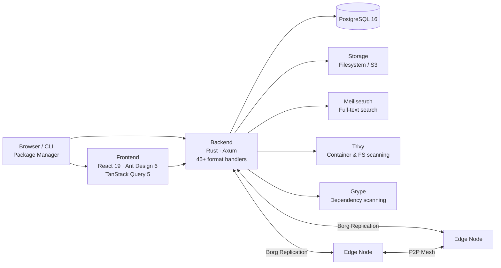
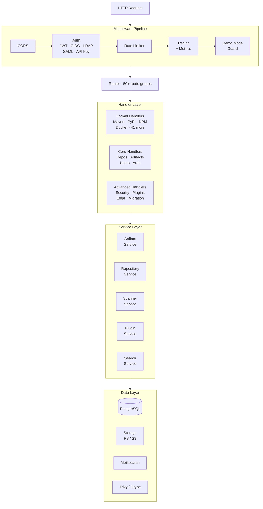
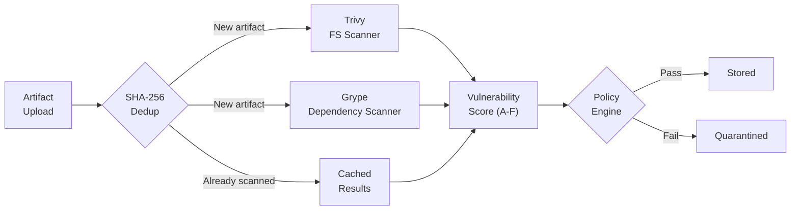
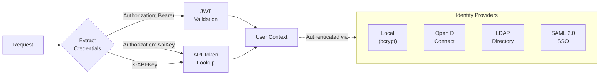
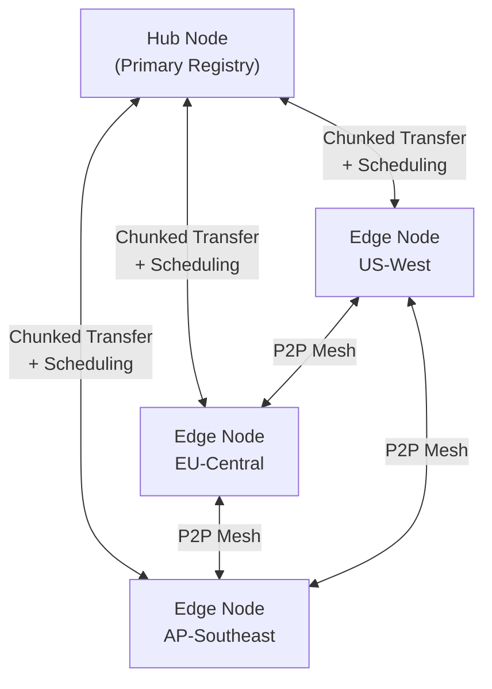
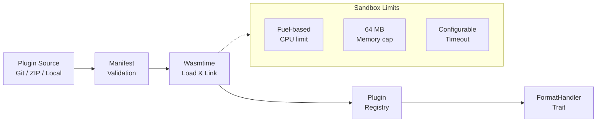

Artifact Keeper is designed as a modular, layered system. This page walks through every major component so you can evaluate whether the architecture fits your needs and contribute with full context.

## System Overview



**Five core services** make up a full deployment:

| Service | Role | Required? |
|---------|------|-----------|
| **Backend** (Rust/Axum) | API server, format handlers, business logic | Yes |
| **PostgreSQL 16** | Metadata, users, scan results, configuration | Yes |
| **Frontend** (React 19) | Web UI served via Nginx | Optional (API-first) |
| **Meilisearch** | Full-text search across artifacts and repos | Optional |
| **Trivy** | Vulnerability scanning for uploaded artifacts | Optional |

Meilisearch, Trivy, and Grype degrade gracefully — the system works without them, just without search or scanning.

## Backend Layers

Every HTTP request flows through the same pipeline:



### Handlers

Handlers are thin HTTP endpoints. They validate input, call services, and format responses. There are three categories:

- **Format handlers** — One per package format (Maven, PyPI, NPM, Docker/OCI, etc.). Each speaks the native wire protocol that `pip install`, `npm publish`, `docker push`, etc. expect.
- **Core handlers** — Repositories, artifacts, users, auth, search, tree browsing.
- **Advanced handlers** — Security scanning, WASM plugins, edge nodes, migration, webhooks, signing.

### Services

Services contain the business logic. They are injected into handlers via Axum's `State` extractor.

| Service | Responsibility |
|---------|---------------|
| `ArtifactService` | Upload, download, versioning, metadata extraction |
| `RepositoryService` | CRUD, virtual repo resolution, proxy upstream |
| `AuthService` | JWT validation, password hashing, token refresh |
| `ScannerService` | Orchestrates Trivy and Grype, aggregates findings |
| `MeiliService` | Index management, search queries |
| `WasmPluginService` | Plugin install, enable, disable, hot reload |
| `EdgeService` | Edge node registration, sync coordination |
| `MigrationService` | Artifactory import orchestration |
| `StorageService` | Abstraction over filesystem and S3 backends |
| `SigningService` | GPG/RSA signing for Debian, RPM, Alpine, Conda |

### Storage

Storage is trait-based with two backends:

```
StorageBackend trait
├── FilesystemStorage   (default, content-addressed by SHA-256)
└── S3Backend           (AWS S3, MinIO, or any S3-compatible service)
```

Artifacts are stored by their SHA-256 hash, enabling automatic deduplication across repositories. The backend chosen via `STORAGE_BACKEND` env var (`filesystem` or `s3`).

### Database

PostgreSQL 16 with 33 migrations covering:

- **Core**: users, roles, repositories, artifacts, artifact_metadata, download_statistics
- **Auth**: api_tokens, groups, permissions
- **Plugins**: plugins, plugin_hooks, plugin_events, plugin_config, format_handlers
- **Security**: scan_configs, scan_results, findings, security_scores, signing_keys
- **Replication**: edge_nodes, peer_connections, transfer_sessions, network_profiles, sync_tasks
- **Operations**: audit_log, webhooks, system_settings, backups, migration_jobs

All queries are compile-time checked via SQLx.

## Security Pipeline



- **Trivy** scans filesystem-based artifacts (wheels, JARs, tarballs, crates) by extracting them into a shared workspace.
- **Grype** performs dependency-tree analysis using SBOMs.
- **Deduplication** — If the SHA-256 hash was already scanned, cached results are reused.
- **Scoring** — Findings are weighted by severity and summed into an A-F grade.
- **Policies** — Admins configure rules (e.g., "block Critical", "quarantine High") per repository or globally.
- **Signing** — GPG and RSA keys can be used to sign repository metadata (Debian Release files, RPM repomd, Alpine APKINDEX, Conda repodata).

## Authentication

Multiple auth providers can be active simultaneously:



- **Local auth** — bcrypt-hashed passwords stored in PostgreSQL
- **OIDC** — Federate with any OpenID Connect provider (Keycloak, Auth0, Okta, etc.)
- **LDAP** — Bind against Active Directory or OpenLDAP
- **SAML 2.0** — Enterprise SSO integration
- **API tokens** — Scoped, expiring tokens for CI/CD and automation
- **Rate limiting** — Per-IP and per-user with configurable windows

## Borg Replication



The replication system distributes artifacts to edge nodes close to consumers:

- **Hub-and-spoke** — The primary registry pushes to registered edge nodes.
- **P2P mesh** — Edge nodes can pull from each other, reducing hub bandwidth.
- **Chunked transfers** — Large artifacts are split into chunks for reliable delivery.
- **Network-aware scheduling** — Bandwidth and latency profiles determine transfer priority.
- **Replication priorities** — Immediate, Scheduled, OnDemand, or LocalOnly per repository.
- **Cache management** — TTL and LRU eviction per edge node with configurable capacity.

## WASM Plugin System

Custom format handlers can be written in any language that compiles to WASM (Rust, Go, C, AssemblyScript, etc.):



- **WIT interface** — Plugins implement a `FormatHandler` contract defined in WebAssembly Interface Types
- **Capabilities** — `parse_metadata`, `validate_artifact`, `generate_index` (each optional)
- **Lifecycle** — Install, enable, disable, reload — all without restarting the server
- **Sandboxing** — Fuel-based CPU metering, memory limits, and execution timeouts via Wasmtime

## Technology Choices

| Layer | Choice | Why |
|-------|--------|-----|
| Backend language | **Rust** | Memory safety without GC, predictable performance, strong type system |
| Web framework | **Axum** | Tower middleware ecosystem, async-first, modular extractors |
| Database | **PostgreSQL 16** | JSONB for flexible metadata, mature tooling, compile-time checked queries via SQLx |
| Frontend | **React 19 + TypeScript** | Component model, widespread ecosystem, type safety |
| UI library | **Ant Design 6** | Enterprise-grade components (tables, forms, modals) out of the box |
| Search | **Meilisearch** | Sub-50ms full-text search, simple to operate, typo tolerance |
| Security scanning | **Trivy + Grype** | Complementary coverage (filesystem + dependency), industry standard, free |
| Plugin runtime | **Wasmtime** | Sandboxed execution, WIT contracts, broad language support |
| Storage | **Filesystem / S3** | Simple default for single-node, S3 for cloud-native deployments |
| CI/CD | **GitHub Actions** | Native integration, matrix builds, reusable workflows |

## Project Structure

```
artifact-keeper/
├── backend/            # Rust backend
│   ├── src/
│   │   ├── api/        # Handlers (50+), middleware, routes
│   │   ├── formats/    # 45+ format handler implementations
│   │   ├── services/   # Business logic (35+ services)
│   │   ├── models/     # Data models (18 types)
│   │   └── storage/    # FS and S3 backends
│   └── migrations/     # 33 PostgreSQL migrations
├── frontend/           # React 19 + TypeScript frontend
│   ├── src/
│   │   ├── pages/      # 29 page components
│   │   ├── components/ # Reusable UI components
│   │   ├── api/        # API client modules
│   │   └── contexts/   # Auth and Theme providers
│   └── e2e/            # Playwright E2E tests
├── edge/               # Edge node service (Rust)
├── site/               # Documentation (Astro + Starlight)
├── specs/              # Feature specifications
├── scripts/            # Test runners and utilities
├── deploy/             # Docker, Kubernetes, demo configs
└── .github/            # CI/CD workflows
```

## What's Next?

- [Quickstart](/docs/getting-started/quickstart/) — Get a local instance running in 5 minutes
- [Package Formats](/docs/package-formats/) — Full list of supported formats with client setup guides
- [REST API Reference](/docs/reference/api/) — Complete API documentation
