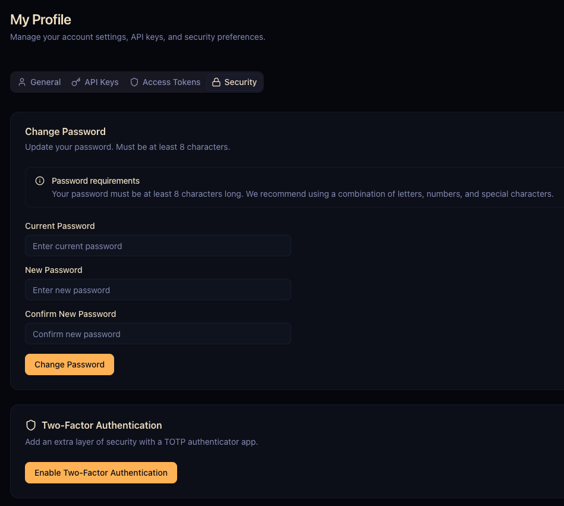

# Quickstart

Get Artifact Keeper up and running in minutes using Docker Compose.

## Prerequisites

- Docker and Docker Compose installed

## Quick Start

1. **Download and start**:

```bash
mkdir artifact-keeper && cd artifact-keeper
curl -fsSLO https://raw.githubusercontent.com/artifact-keeper/artifact-keeper/main/docker-compose.yml
curl -fsSLO https://raw.githubusercontent.com/artifact-keeper/artifact-keeper/main/Caddyfile
docker compose up -d
```

This starts the full stack:
- **Backend** — Rust API server with 45+ format handlers
- **Web UI** — Next.js frontend
- **Caddy** — Reverse proxy (HTTP on port 30080, HTTPS on port 30443)
- **PostgreSQL 16** — Metadata storage
- **Meilisearch** — Full-text search
- **Trivy** — Vulnerability scanning

2. **Access the UI**:

Open [http://localhost:30080](http://localhost:30080) in your browser.

3. **Complete first-time setup**:

On first boot, you'll see the setup screen with instructions to retrieve the generated admin password:


Run the command shown in the banner to get your password, then log in with username `admin`.

:::tip
To skip the setup lock entirely, set `ADMIN_PASSWORD=yourpass` in your `.env` file before starting.
:::

<details>
<summary>**CLI alternative** (for automation or headless setups)</summary>

```bash
# Get the generated password
docker exec artifact-keeper-backend cat /data/storage/admin.password && echo

# Login with the generated password
TOKEN=$(curl -s http://localhost:30080/api/v1/auth/login \
  -H "Content-Type: application/json" \
  -d '{"username":"admin","password":"<password-from-file>"}' | jq -r '.access_token')

# Get your user ID
USER_ID=$(curl -s http://localhost:30080/api/v1/auth/me \
  -H "Authorization: Bearer $TOKEN" | jq -r '.id')

# Change password (this unlocks the API)
curl -X POST "http://localhost:30080/api/v1/users/$USER_ID/password" \
  -H "Authorization: Bearer $TOKEN" \
  -H "Content-Type: application/json" \
  -d '{"new_password":"your-secure-password"}'
```

</details>

4. **Secure your admin account**:

After changing your password, enable Two-Factor Authentication (2FA) for the admin account. Navigate to **My Profile → Security** and click **Enable Two-Factor Authentication**.



:::caution[Recommended]
Always enable 2FA on the admin account. This protects against credential theft and is required for production deployments.
:::

5. **Verify everything works**:

```bash
# Health check
curl http://localhost:30080/health

# List repositories
curl -s http://localhost:30080/api/v1/repositories \
  -H "Authorization: Bearer $TOKEN" | jq
```

## First Steps

### Create Your First Repository

```bash
curl -X POST http://localhost:30080/api/v1/repositories \
  -H "Authorization: Bearer $TOKEN" \
  -H "Content-Type: application/json" \
  -d '{
    "key": "my-maven-repo",
    "format": "maven",
    "repo_type": "local",
    "description": "My first Maven repository"
  }'
```

Or use the Web UI: navigate to **Repositories** and click **Create Repository**.

### Push Your First Artifact

**Maven** (in your `pom.xml`):
```xml
<distributionManagement>
  <repository>
    <id>artifact-keeper</id>
    <url>http://localhost:30080/api/v1/maven/my-maven-repo</url>
  </repository>
</distributionManagement>
```

**npm** (using `.npmrc`):
```
registry=http://localhost:30080/api/v1/npm/my-npm-repo/
//localhost:30080/api/v1/npm/my-npm-repo/:_authToken=YOUR_TOKEN
```

**Docker**:
```bash
docker tag myimage:latest localhost:30080/api/v1/docker/my-docker-repo/myimage:latest
docker push localhost:30080/api/v1/docker/my-docker-repo/myimage:latest
```

**PyPI** (using twine):
```bash
twine upload --repository-url http://localhost:30080/api/v1/pypi/my-pypi-repo/ \
  -u admin -p admin dist/*
```

## Next Steps

- [Installation Guide](/docs/getting-started/installation) — Build from source or customize your deployment
- [Configuration Reference](/docs/getting-started/configuration) — Storage, authentication, and integrations
- [Package Formats](/docs/package-formats) — All 45+ supported formats and their endpoints
- [Docker Deployment](/docs/deployment/docker) — Production Docker Compose setup

## Stopping the Services

```bash
docker compose down
```

To remove all data (databases, artifacts):

```bash
docker compose down -v
```
